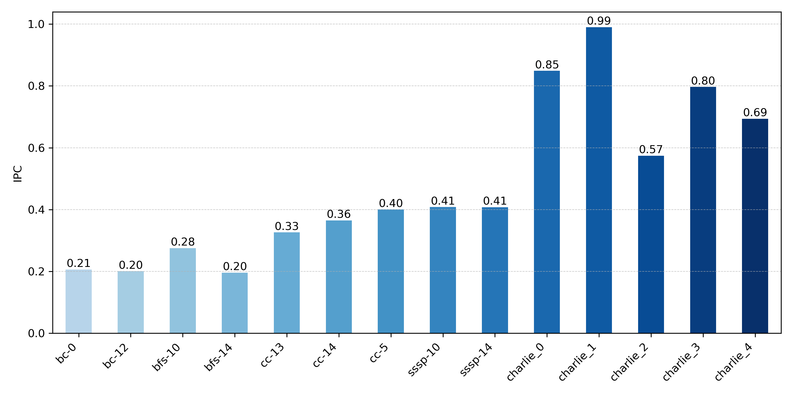
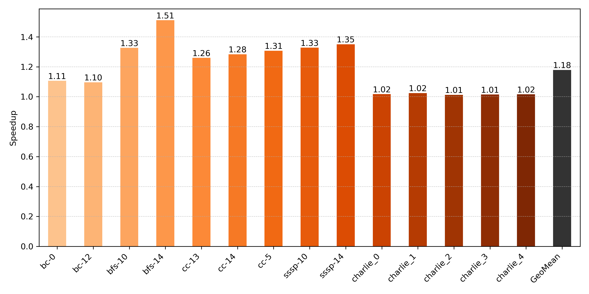
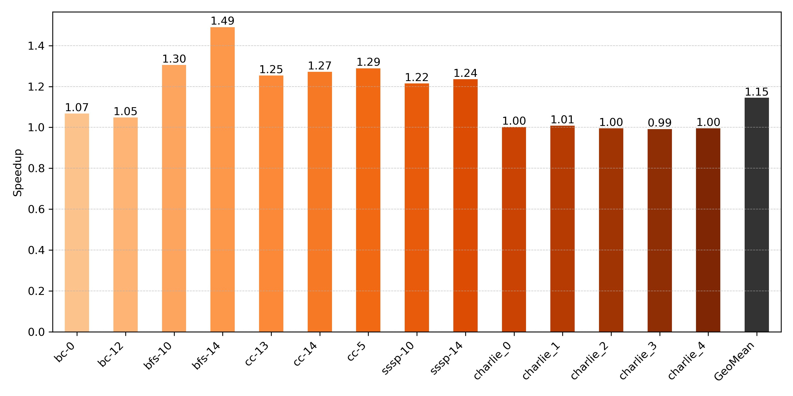
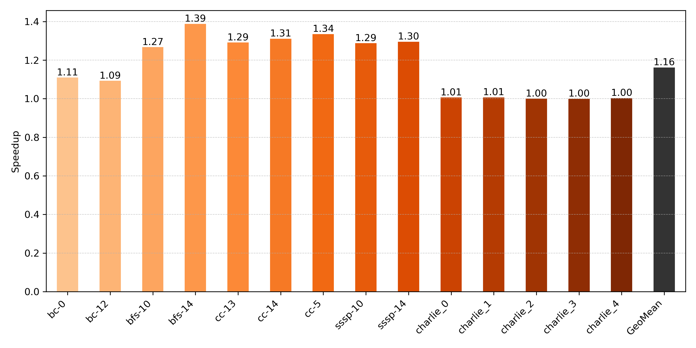

# Report Lab 4
## Introduction
In the fourth installment of the computer architecture lab we are asked to implement a set of prefetchers in the ChampSim simulator environment.

## Warmup
In the warmup we are asked to run the baseline CPU simulation without a prefetcher attatched. In Figure 1 we can see the IPC plot for the baseline configuration. It is easy to see that there are significant differences between the applications performance. We can clearly see that charlie_0 has the highest ICU and is therefore the most performant or fastest trace, while bc-12 and bfs-14 are the least performant or the slowest. The bc-0 trace is also not far off from bc-12 and bfs-14. Further we observe that the traces from the GAP dataset are a lot slower then the traces from the charlie dataset.



## Task 1
In the first task we are asked to implement a basic global-history-buffer-based stride prefetcher. A description of the algorithm is given in the paper by Kyle et. al.[^1]

### Implementation
The algorithm makes use of two main structures. A global-history-buffer(GHB) and an index-table(IT).
```
// global-history-buffer entry struct
typedef struct {
	uint64_t gm_addr; // global-miss-address
	uint16_t ghb_link; // link to previous ghb_entry
	uint16_t tag; // index table tag
	uint16_t head; // ghb_pointer that holds the head at the time off adding the entry
} ghb_entry_t;

// index-table entry struct
typedef struct {
	uint16_t ghb_ptr; // pointer to the GHB entry
	uint16_t tag; // tag optained from the PC
	bool valid; // valid bit for the entry
} it_entry_t;
```
On a cache access an index/tag/address triple is created. Where the index refers to the position inside the IT and is made up of the lowest 8 bits of the instruction pointer and the tag of the next higher 8 bits. The address is the block-address of the accessed cache block. The prefetcher probes the IT. If successfull it traverses the GHB to find the two previous memory accesses with the same index and tag. From these it can compute the respective strides in memory. If these match then the prefetcher prefetches the next 6 entries with the same strides. As a last step the prefetcher adds the newest cache access to its IT and GHB.

For this first implementation many values were hardcoded to show the advantage of dynamically changing them during runtime in a later task.


### Results
In Figure 2 we see the relative speedup for the implemented GHB-stride prefetcher relative to the baseline evaluated in the Warmup step of the lab. Charlie_2 and charlie_3 show the smallest speedup with 1.01 but in general it can be observed that the traces from the charlie dataset show barely any performance difference. On the other hand we see very clear improvements for the traces in the GAP dataset. The speedup is seen in bfs-14 which is the trace with the worst baseline ICU. Observe also, that no traces shows a speedup below 1. So adding a prefetcher in this system configuration shows a strict performance increase.



[^1]: Kyle J. Nesbit and James E. Smith. Data cache prefetching using a global history buffer. In HPCA, 2004

## Task 2
### Results
In the second task we are asked to evalueate the GHB-stride prefetcher in a system with limited memory bandwidth.
In Figure 3 we can see the speedup of the GHB-stride prefetcher relative to the baseline without a prefetcher both run in a system with a limited memory bandwidth. We can make a few important observations. (1) We can directly see that the geometric mean of the speedup has decreased indicating that the GHB-stride prefetcher does not only perform worse in absolute numbers with a limited bandwidth but also its relative performance to the baseline decreases. The biggest performance difference can be seen in the traces sssp-10 and ssp-14, with -0.11 and -0.09 respectively. The smallest performance loss can be observed with charlie_1 and charlie_2 which show a difference of -0.01. In general the traces from the charlie dataset show a smaller performance loss than those from the GAP dataset. But in for the trace charlie_3 we see a speedup of 0.99, meaning that it runs slower with the prefetcher than without.



### Discussion
In the data we see a performance loss in every trace. This stems from the implementation of the prefetcher. The prefetcher is not aware of the system and therefore does not know how much memory bandwidth is still free. In the implementation we hardcoded the prefetch degree meaning that the prefetcher will always prefetch the next 6 memory addresses. If the memory bus is close to or already at capacity this becomes an issue as it in the best case slows down the prefetching and in the worst case slows down the entire CPU as other memory that is needed cannot be fetched due to the bus being clogged by prefetcher requests.

## Task 3
In the third task we were asked to extend our prefetcher with system awareness. The system awareness is based on a hueristic scheme to increase or decrease the prefetch degree based on the available memory bandwidth and the accuracy of the prefetcher.

### Implementation
The system awareness is represented by the `prefetch_distance` variable in the code. This variable is equivalent to the prefetch dgree from the task description. To allow for online changing of this parameter a cycle counter is implemented. Once an epoch has passed (1000 cycles) the performance of the last epoch is evaluated by requesing the memory bandwidth usage and calculating the prefetch efficiency. With this information the prefetcher can then adapt the prefetch degree.
```
// method to calculate the prefetch distance
int16_t ghb_stride_sys_aware::calculate_prefetch_distance(float accuracy, uint8_t memory_bw_usage)
{
  if (memory_bw_usage >= GHB_MEMORY_BW_USAGE_UPPER_THRESHOLD) {
    if (accuracy >= GHB_ACCURACY_UPPER_THRESHOLD) 
      return prefetch_distance;
    if (accuracy >= GHB_ACCURACY_LOWER_THRESHOLD)
      return prefetch_distance - 1;
    return prefetch_distance - 2;
  }

  if (memory_bw_usage >= GHB_MEMORY_BW_USAGE_LOWER_THRESHOLD) {
    if (accuracy >= GHB_ACCURACY_UPPER_THRESHOLD) 
      return prefetch_distance + 1;
    if (accuracy >= GHB_ACCURACY_LOWER_THRESHOLD)
      return prefetch_distance;
    return prefetch_distance - 1;
  }

  if (accuracy >= GHB_ACCURACY_UPPER_THRESHOLD) 
    return prefetch_distance + 2;
  if (accuracy >= GHB_ACCURACY_LOWER_THRESHOLD)
    return prefetch_distance + 1;
  return prefetch_distance;
}
```

### Results
Figure 4 shows the speedup of the system-aware GHB-stride prefetcher with full bandwidth relative to the system with no prefetcher at full bandwidth. If we compare this with Figure 2 from Task 1 we see no difference in performance. This makes sense as we initialized our system-aware prefetcher at the hardcoded values for the not system-aware prefetcher. If the prefetcher is never limited by the memory bandwidth then he will perform the same as the non system-aware prefetcher.


Figure 5 shows the speedup of the system aware GHBS-stride prefetcher with limited bandwidth relative to the system with no prefetcher at limited bandwidth. We see that the geometric mean is higher for the system-aware prefetcher. We see higher or equal speedup for all traces except for bfs-10 and bfs-14 where the speedup reduces by 0.03 and 0.1 respectively.



### Discussion
From the non-limited bandwidth analysis we gain that the system-aware prefetcher can perform at the same level as the non-system-aware prefetcher. This is an important sanity check to confirm that the system awareness can provide the same optimal performance under optimal conditions. From analysing the limited bandwidth data we understand that the system awareness comes at a cost. We clearly see that for some specific traces we loose a lot of performance due to the system-awareness.

## Task 4
In the fourth task we were asked to implement our own prefetcher design. I have opted for a delta correlation prefetcher as it is the natural extension of the stride prefetcher. The basic logic behind a delta correlation prefetcher is to store the deltas, i.e. differences between memory accesses. Over time the prefetcher builds a table associating consecutive deltas. This allows the prefetcher to predict the next delta by computing the last delta and looking in the table which delta is most likely to follow.

### Implementation
The delta correlation prefetcher builds on the foundations of the GHB-stride prefetcher. We use the same GHB and IT structs to store the past memory accesses. To this we add a delta-correlation-table(DCT) which stores the different deltas.
```
// delta correlation table entry struct
typedef struct {
	int64_t delta;
	int64_t next_deltas[DCT_NUM_CANDIDATES]; // array of possible following deltas
	uint8_t counters[DCT_NUM_CANDIDATES]; // occurence of following deltas
} dct_entry_t;
```
The prefetcher walks the IT and GHB in the same fassion as in the GHB-stride prefetcher. The prefetcher also computes the last two strides, I refer to them as `delta1` and `delta2` here to avoid confusion, by taking the difference of past cache block addresses. The prefetcher probes the DCT entry of `delta2` with `delta1`. If the entry is already aware of `delta1` then the prefetcher increases the respective counter. If not then the position with the lowest counter is evicted and replaced with `delta1`.

Next the prefetcher tries to predict the future memory access. For this he starts form the known `delta1` and probes its DCT entry for the most likely follow-up delta. It prefetches the cache block address at `current_address + delta`. It then proceeds from the predicted delta and tries to predict further by probing the DCT entry at the location of the predicted delta. The prefetcher repeats this for the same prefetch degree as the stride prefetcher. Allowing it to be system-aware with the same logic.

### Results

## Bonus Task